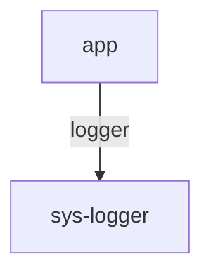

# EazyCore

> A deterministic, contract-driven plugin runtime for Node.js
> Inspired by VS Code extensions and Cloud9 Architect.


<details>
<summary>
<strong>⚠️ DISCLAIMER:</strong> EazyCore is currently an <strong>experimental prototype</strong>. <strong>Breaking changes are expected</strong>
</summary>

<br/>

While the core architecture is production-inspired and intentionally rigorous, **this project is not yet API-stable**.

### What This Means

- 🚧 **Breaking changes are expected**
- 🔁 Entire subsystems may be **rewritten or replaced**
- 🧪 APIs may change without deprecation warnings
- 🧩 Plugin contracts are still evolving

</details>

---

## Overview

**EazyCore** is a **production-grade plugin orchestration engine** designed to build modular, extensible systems with:

* Strong runtime contracts
* Explicit dependency graphs
* Isolated worker execution
* Transparent RPC
* Deterministic startup & shutdown

It enables you to build systems where **plugins are first-class architectural units**, not ad-hoc imports.

---

## Key Features

* 🔒 **Strong Contracts** via Zod
* 🧩 **Explicit Dependency Graph**
* 🔁 **Automatic Topological Ordering**
* 🧵 **Main Thread & Worker Isolation**
* 📡 **Transparent RPC (Main ⇄ Worker)**
* 🔌 **Dependency Injection Across Threads**
* 🧹 **Graceful Lifecycle Management**
* 📊 **Mermaid Graph Visualization**
* ❄️ **Registry Freezing for Security**

---

## Installation & Build

### Prerequisites

* **Node.js 18+**
* **Bun** (recommended and currently required)

> The project is optimized and tested primarily with **Bun**. Other runtimes are not yet officially supported.

---

## Build the Core Library

```sh
git clone https://github.com/your-org/eazycore.git
cd eazycore
bun install
bun run build
```

This will:

* Compile `packages/eazycore/src` → `dist`
* Generate ESM output (`.mjs`)
* Emit TypeScript declaration files (`.d.mts`)

---

## Running Examples

Example applications live under the `examples/` directory and are intended to demonstrate:

* Plugin definitions
* Dependency wiring
* Worker execution
* RPC behavior

### Simple Example App

```sh
cd examples/simple-app
bun install
bun run dev
```

This example runs a small plugin graph using **EazyCore**, including worker-based plugins and dependency injection.

---

## Development Workflow

For core development:

```sh
# From repo root
bun install
bun run build --watch
```

Then run examples in a separate terminal.

---

## Core Concepts

### Plugin Type

A **Plugin Type** defines:

* Configuration schema
* Dependency contracts
* Setup & teardown logic

```ts
import { definePlugin } from 'eazycore';
import { z } from 'zod';

export const LoggerPlugin = definePlugin({
  id: 'logger',
  schema: z.object({ prefix: z.string() }),

  setup(ctx, config) {
    ctx.registerService('logger', z.any(), {
      info(msg: string) {
        console.log(config.prefix, msg);
      },
    });
  },
});
```

---

### Plugin Instance

A **Plugin Instance** is a concrete node in the system graph.

```ts
const logger = LoggerPlugin.create(
  'sys-logger',
  { prefix: '[APP]' }
);
```

---

## Dependency Wiring

Plugins declare **requirements** and wire them explicitly.

```ts
export const AppPlugin = definePlugin({
  id: 'app',
  schema: z.object({}),
  requirements: {
    logger: z.any(),
  },

  setup(ctx, _config, deps) {
    deps.logger.info('Hello world');
  },
});
```

```ts
const app = AppPlugin.create(
  'app',
  {},
  { logger: 'sys-logger' }
);
```

---

## Execution Modes

### Main Thread

Default execution mode.

```ts
AppPlugin.create('app', {}, wiring, 'main');
```

* Direct calls
* Lowest latency
* Full context access

---

### Worker Mode

Isolated execution in a Node.js Worker.

```ts
AppPlugin.create('app', {}, wiring, 'worker');
```

* CPU isolation
* Fault containment
* Transparent RPC

Worker plugins **access dependencies exactly the same way**:

```ts
deps.logger.info('From a worker');
```

---

## Bootstrapping

```ts
import { EazyCore } from 'eazycore';

const core = new EazyCore();

core.registerDefinition(LoggerPlugin);
core.registerDefinition(AppPlugin);
core.lockDefinitions();

core.registerPlugin(logger);
core.registerPlugin(app);

await core.start();
```

---

## Lifecycle Management

### Startup

* Dependency graph is validated
* Cycles are detected
* Plugins start in topological order

### Shutdown

```ts
await core.stop();
```

* Reverse topological teardown
* Graceful worker shutdown
* Forced termination fallback

---

## Visualizing the System

```ts
await core.start({ dryRun: true });
```

Outputs a Mermaid diagram:



---

## Error Handling

* Configuration validation failures stop startup
* Missing wiring fails fast
* RPC calls support timeouts
* Worker failures are isolated

---

## Security Model

### Current Guarantees

* Worker isolation
* Contract validation
* Registry freezing

### Not Yet Included

* Permission system
* Resource quotas
* Capability sandboxing

---

## When to Use EazyCore

- ✅ Modular backends
- ✅ Plugin ecosystems
- ✅ Multi-tenant runtimes
- ✅ Tooling platforms
- ✅ Long-running services


- ❌ Simple scripts
- ❌ Tight latency-critical loops

---

## Design Philosophy

* Explicit > implicit
* Contracts > conventions
* Determinism > magic
* Isolation by default
* Fail fast, tear down cleanly
* Excellent DX (developer experience)

---

## ⚠️ Prototype Disclaimer

> **Important:** EazyCore is currently an **experimental prototype**.

While the core architecture is production-inspired and intentionally rigorous, **this project is not yet API-stable**.

### What This Means

* 🚧 **Breaking changes are expected**
* 🔁 Entire subsystems may be **rewritten or replaced**
* 🧪 APIs may change without deprecation warnings
* 🧩 Plugin contracts are still evolving

### Why This Exists

EazyCore is an **exploration phase** toward a next-generation plugin platform inspired by:

* VS Code’s extension host
* Cloud9 Architect
* Distributed service runtimes

Our long-term goal is a system that is:

* **Event-driven** (not call-driven)
* **Distributed by default**
* **More secure than traditional extension systems**
* **More performant and observable**
* **Capable of cross-process and cross-machine execution**

The current system focuses on **correctness, isolation, and determinism first**, with future iterations moving toward:

* Capability-based permissions
* Message-bus-driven plugins
* Fine-grained scheduling
* Stronger sandboxing
* Observability baked into the runtime

---

## Stability Policy

| Area           | Stability        |
| -------------- | ---------------- |
| Core concepts  | 🟡 Mostly stable |
| Plugin APIs    | 🔴 Experimental  |
| Worker model   | 🟡 Evolving      |
| RPC layer      | 🔴 Experimental  |
| Config schemas | 🔴 Experimental  |

If you adopt EazyCore today, **expect to track upstream closely**.

---

## Intended Audience (Current Phase)

EazyCore is currently best suited for:

* Platform engineers
* Runtime designers
* Plugin system experimentation
* Internal tooling
* Architecture exploration

It is **not yet recommended** for:

* Public plugin marketplaces
* Third-party untrusted extensions
* Long-term API commitments

---

## License

MIT
